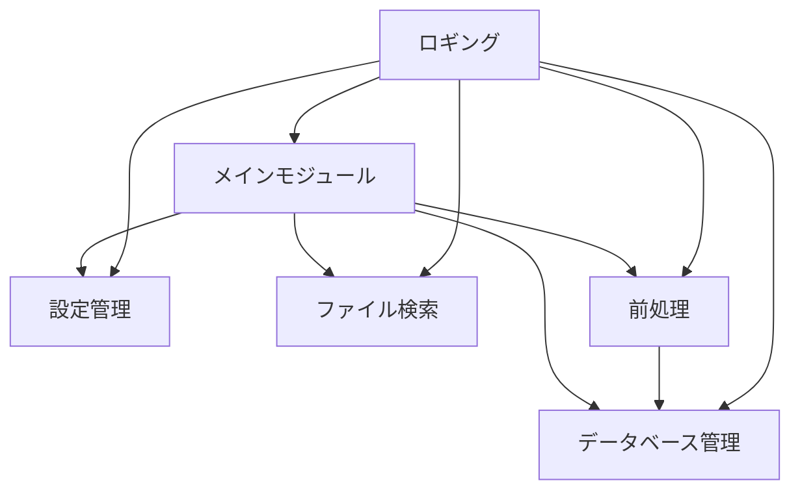
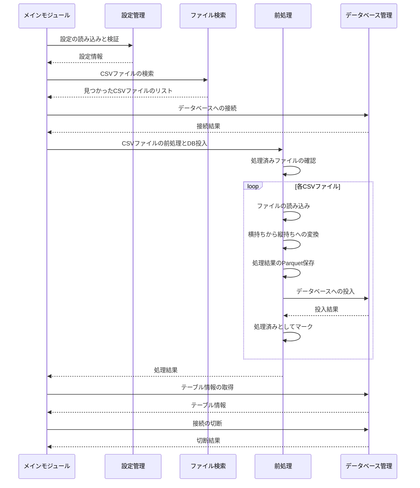

# 技術リファレンス

このドキュメントでは、CSV to DBツールの内部アーキテクチャと処理フローについて詳細に説明します。

## アーキテクチャ概要

CSV to DBツールは、以下のコンポーネントで構成されています：



### 主要コンポーネント

- **メインモジュール** (`src/main.py`): ツールのエントリーポイントとなるモジュールで、全体の処理フローを制御します
- **設定管理** (`src/config.py`): 環境変数から設定を読み込み、検証するコンポーネントです
- **ファイル検索** (`src/file_finder.py`): 指定されたフォルダ内でパターンに一致するCSVファイルを検索するコンポーネントです
- **前処理** (`src/preprocessor.py`): CSVファイルを読み込み、横持ちデータから縦持ちデータに変換するコンポーネントです
- **データベース管理** (`src/db.py`): DuckDBデータベースとの接続を管理し、データの取り込みを行うコンポーネントです
- **ロギング** (`src/logger.py`): ログメッセージの出力を管理するコンポーネントです

## 処理フロー

CSV to DBツールの処理フローは以下の通りです：



## 各モジュールの詳細

### メインモジュール (`src/main.py`)

メインモジュールは、ツールのエントリーポイントとなるモジュールで、以下の処理を行います：

1. ロガーの設定
2. 設定の読み込みと検証
3. CSVファイルの検索
4. データベースへの接続
5. CSVファイルの前処理とデータベースへの投入
6. 処理結果の表示

```python
def main():
    """メイン実行関数"""
    # ロガーの設定
    setup_logger()

    # 設定の読み込みと検証
    config = Config()
    config.log_settings()

    if not config.validate():
        return

    # 検索開始のログ出力
    log_search_start(config.folder, config.pattern)

    # 指定されたパターンに一致するCSVファイルを検索
    csv_files = find_csv_files(config.folder, config.pattern)

    # 結果の表示
    log_csv_files(csv_files, config.folder)

    if not csv_files:
        logging.info("処理対象のCSVファイルが見つかりませんでした。")
        return

    # データベースへの接続
    logging.info("データベースへの接続を開始します...")
    db_manager = DatabaseManager(config.db, config.encoding)
    if not db_manager.connect():
        logging.error("データベースへの接続に失敗しました。")
        return

    # 前処理と直接DBへの投入を実行
    logging.info("CSVファイルの前処理と直接DBへの投入を開始します...")
    preprocessor_config = PreprocessorConfig()
    preprocessor = CsvPreprocessor(preprocessor_config)

    # 処理時間の計測開始
    start_time = time.time()

    # テーブル名の設定
    table_name = "sensor_data_integrated"

    # CSVファイルを処理して直接DBに投入
    total_records = preprocessor.process_all_files_to_db(
        csv_files, db_manager, table_name
    )

    # 処理時間の計測終了
    end_time = time.time()
    processing_time = end_time - start_time
    logging.info(f"前処理と直接DBへの投入の実行時間: {processing_time:.3f}秒")

    if total_records > 0:
        # テーブル情報を表示
        table_info = db_manager.get_table_info(table_name)
        if table_info:
            logging.info(f"テーブル {table_name} の構造:")
            for col in table_info:
                logging.info(f"  {col[1]} ({col[2]})")

            logging.info(f"インポートされたレコード数: {total_records}")
    else:
        logging.info("処理対象のCSVファイルはありませんでした。")

    db_manager.close()
    logging.info("データベースへの直接取り込みが完了しました。")
```

### 設定管理 (`src/config.py`)

設定管理モジュールは、環境変数から設定を読み込み、検証するコンポーネントです。以下の設定項目を管理します：

- `FOLDER`: 検索対象のフォルダパス（必須）
- `PATTERN`: CSVファイル名の検索パターン（必須）
- `DB`: 使用するデータベースファイル（デフォルト: `sensor_data.duckdb`）
- `ENCODING`: ファイルのエンコーディング（デフォルト: `utf-8`）
- `PLANT`: プラント名（デフォルト: `""`）
- `MACHINE_ID`: 機械ID（デフォルト: `""`）
- `DATA_LABEL`: データラベル（デフォルト: `""`）

```python
class Config:
    """アプリケーション設定を管理するクラス"""

    def __init__(self):
        """環境変数から設定を読み込む"""
        # .envファイルを強制的に再読み込み
        load_dotenv(override=True)

        # 必須の環境変数
        self.folder = os.getenv("FOLDER")
        self.pattern = os.getenv("PATTERN")

        # オプションの環境変数（デフォルト値付き）
        self.db = os.getenv("DB", "sensor_data.duckdb")
        self.encoding = os.getenv("ENCODING", "utf-8")
        self.plant = os.getenv("PLANT", "")
        self.machine_id = os.getenv("MACHINE_ID", "")
        self.data_label = os.getenv("DATA_LABEL", "")

    def validate(self):
        """設定値を検証する"""
        if not self.folder or not self.pattern:
            logging.error(".envファイルにFOLDERまたはPATTERNが設定されていません。")
            return False

        # フォルダの存在確認
        folder_path = Path(self.folder)
        if not folder_path.exists():
            logging.error(f"指定されたフォルダが存在しません: {self.folder}")
            return False

        return True
```

### ファイル検索 (`src/file_finder.py`)

ファイル検索モジュールは、指定されたフォルダ内でパターンに一致するCSVファイルを検索するコンポーネントです。通常のファイルシステム内のCSVファイルだけでなく、ZIPファイル内のCSVファイルも検索対象となります。

```python
def find_csv_files(base_folder, pattern_str):
    """指定されたフォルダ内でパターンに一致するCSVファイルを検索する"""
    pattern = re.compile(pattern_str)
    csv_files = []
    base_path = Path(base_folder)

    # 通常のファイルシステム内を検索（再帰的に全てのファイルを取得）
    for file_path in base_path.glob("**/*"):
        if file_path.is_file():
            # CSVファイルの検索
            if file_path.suffix.lower() == ".csv" and pattern.search(file_path.name):
                csv_files.append({"path": str(file_path), "type": "file"})

            # ZIPファイルの検索と処理
            elif file_path.suffix.lower() == ".zip":
                csv_files.extend(_process_zip_file(file_path, pattern))

    return csv_files
```

### 前処理 (`src/preprocessor.py`)

前処理モジュールは、CSVファイルを読み込み、横持ちデータから縦持ちデータに変換するコンポーネントです。また、処理済みファイルの管理や、処理結果のParquetファイルへの保存、データベースへの投入も行います。

```python
class CsvPreprocessor:
    """CSVファイルの前処理を行うクラス"""

    def __init__(self, config):
        """前処理クラスを初期化する"""
        self.config = config
        self.processed_files = self._load_processed_files()

    def process_file(self, file_info):
        """CSVファイルを前処理する"""
        # ファイルの読み込みと前処理
        # 横持ちデータから縦持ちデータへの変換
        # 処理結果のParquetファイルへの保存
        # 処理済みとしてマーク
        ...

    def process_all_files_to_db(self, csv_files, db_manager, table_name):
        """複数のCSVファイルを処理し、直接データベースに投入する"""
        # 各ファイルの処理
        # 処理結果のデータベースへの投入
        # 重複の削除
        ...
```

### データベース管理 (`src/db.py`)

データベース管理モジュールは、DuckDBデータベースとの接続を管理し、データの取り込みを行うコンポーネントです。

```python
class DatabaseManager:
    """データベース操作を管理するクラス"""

    def __init__(self, db_path, encoding="utf-8"):
        """データベースマネージャーを初期化する"""
        self.db_path = Path(db_path)
        self.encoding = encoding
        self.connection = None

        # データベースディレクトリが存在しない場合は作成
        db_dir = self.db_path.parent
        if not db_dir.exists():
            db_dir.mkdir(parents=True, exist_ok=True)

    def connect(self):
        """データベースに接続する"""
        ...

    def import_dataframe(self, df, table_name, if_exists="append"):
        """Polarsデータフレームを直接データベースにインポートする"""
        ...
```

## データベーススキーマ

CSV to DBツールは、処理したデータを`sensor_data_integrated`テーブルに保存します。このテーブルのスキーマは以下の通りです：

| カラム名 | データ型 | 説明 |
|---------|---------|------|
| TIME | TIMESTAMP | 測定時間 |
| VALUE | DOUBLE | 測定値 |
| PLANT | VARCHAR | プラント名 |
| MACHINE_ID | VARCHAR | 機械ID |
| DATA_LABEL | VARCHAR | データラベル |
| SENSOR_ID | VARCHAR | センサーID |
| SENSOR_NAME | VARCHAR | センサー名 |
| SENSOR_UNIT | VARCHAR | センサー単位 |
| file_name | VARCHAR | 元のファイル名 |

## パフォーマンスに関する考慮事項

CSV to DBツールは、以下のパフォーマンス最適化を行っています：

1. **Polarsの使用**: データ処理には高速なデータフレームライブラリであるPolarsを使用しています
2. **DuckDBの使用**: データベースには高速な組み込みSQLデータベースエンジンであるDuckDBを使用しています
3. **Parquetファイルの使用**: 処理結果は圧縮効率と読み込み速度に優れたParquet形式で保存しています
4. **処理済みファイルの管理**: ハッシュ値を使用して処理済みファイルを管理し、重複処理を防止しています
5. **直接データベースへの投入**: 処理したデータを一時ファイルを経由せずに直接データベースに投入しています

## 拡張ポイント

CSV to DBツールは、以下の拡張ポイントを提供しています：

1. **新しいCSV形式のサポート**: `src/preprocessor.py`の`_read_special_csv`メソッドを拡張することで、新しいCSV形式をサポートできます
2. **新しいデータベースのサポート**: `src/db.py`の`DatabaseManager`クラスを拡張することで、新しいデータベースをサポートできます
3. **新しいファイル形式のサポート**: `src/file_finder.py`の`find_csv_files`関数を拡張することで、新しいファイル形式（例: Excel）をサポートできます
4. **新しい前処理の追加**: `src/preprocessor.py`の`CsvPreprocessor`クラスを拡張することで、新しい前処理（例: データのフィルタリング）を追加できます

## 次のステップ

- [ユーザーマニュアル](user_manual.md)に戻って、ツールの基本的な使い方を確認する
- [開発者ガイド](developer_guide.md)を参照して、ツールの拡張方法について学ぶ
